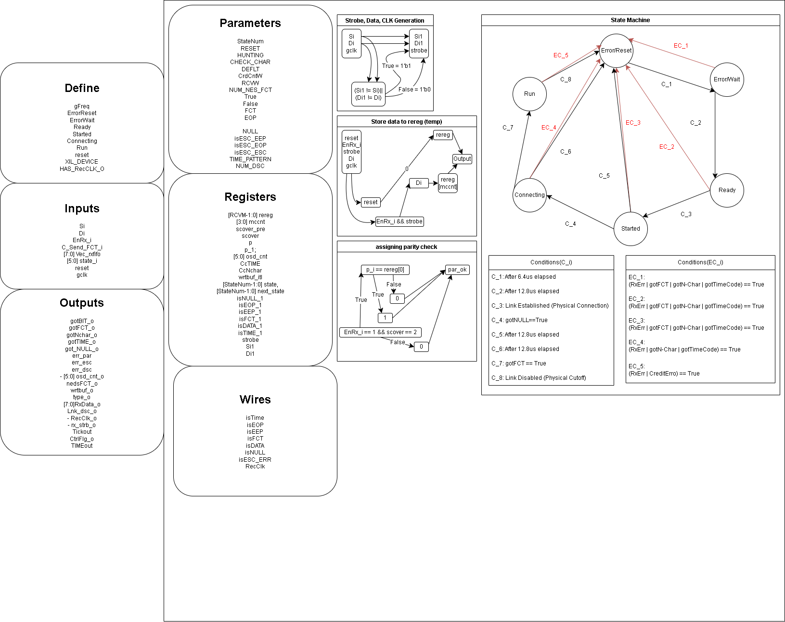

# caduceus
A SpaceWire Standard Compliant Lightweight RTL IP For beginners to learn and experiment with.

### Overview:
##### Provided by StarDundee, the Spacewire Standard maps out roughly to this.(Draw.io is a pretty handy tool XD)

### changelog:
#### 19-03-26: Implemented the first layer, the physical layer of the IP, which connects to the LVDS wires between modules 
#### 20-03-26: Expanded README, physical layer implementation was achieved without verif. First layer was made successfully.  
